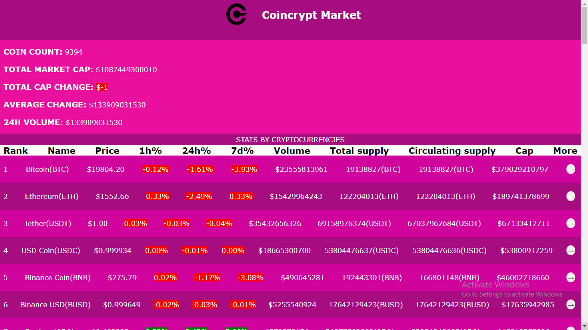

# Project Name

Coincrypt Market

> A web application for a company that provides financial data for effecting crptocurrency trading and analysis.
## Built With
- React
- Redux
- React testing Library
-Jest

## Screenshot

## Live Demo

View live [here]()
## Getting Started

To get a local copy up and running follow these simple example steps.

### Using it Locally

- Clone the project from GitHub [here](git@github.com:stephnna/financial-sentiments-app.git)
- Run the following commands as listed in your terminal:
- `npm install`
- `npm start`
## Available Scripts

In the project directory, you can run:

### `npm start`

Runs the app in the development mode.\
Open [http://localhost:3000](http://localhost:3000) to view it in your browser.

The page will reload when you make changes.\
You may also see any lint errors in the console.

### `npm test`

Launches the test runner in the interactive watch mode.\
See the section about [running tests](https://facebook.github.io/create-react-app/docs/running-tests) for more information.

👤 **Ezea Stephen Nnabuike**

- GitHub: [@stephnna](https://github.com/stephnna)
- Twitter: [@stephnna](https://twitter.com/stephnna)
- LinkedIn: [LinkedIn](https://www.linkedin.com/in/stephen-ezea/)

## 🤝 Contributing

Contributions, issues, and feature requests are welcome!

Feel free to check the [issues page](../../issues/).

## Show your support

Give a ⭐️ if you like this project!

## Acknowledgments

- Hat tip to anyone whose code was used
- Inspiration
- etc

## 📝 License